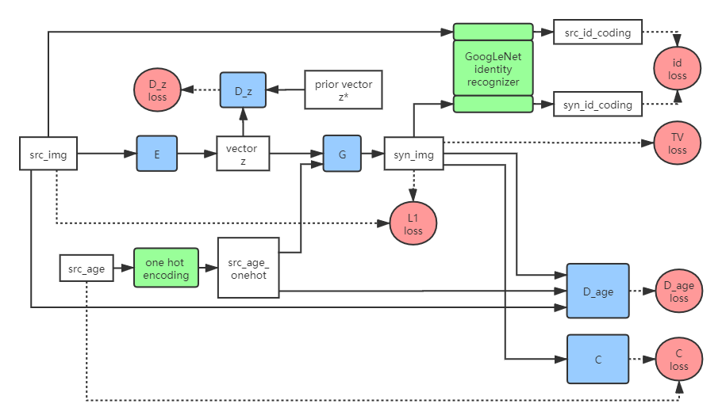

# Aging Face Generation with c-GAN
  
Using a c-GAN framework to generate aging faces. Encoder encodes the source image to obtain latent vector, which is input into generator along with age label. Multiple adversarial networks are added to maintain identity features and age features.  
  
The following pictures are overall frameworks of face generation and age estimation models.  
  


  
### Prerequisites
Python 3  
  
- torch==1.5.1
- torchvision==0.6.1
- matplotlib==3.1.0
- Pillow==6.1.0
- numpy==1.16.4
- requests==2.22.0
```
pip install -r requirements.txt
```

### Dataset
Download UTKFace dataset for model training. Devide the dataset into training set as well as test set and validation set.
```
python prepare.py
```

### Training
```

```
  


