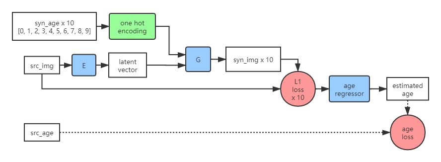

# Aging Face Generation with c-GAN
  
Using a c-GAN framework to generate aging faces. Encoder encodes the source image to obtain latent vector, which is input into generator along with age label. Multiple adversarial networks are added to maintain identity features and age features.  
  
The following pictures are overall frameworks of face generation and age estimation models.  
  


  
### Prerequisites
Python 3  
  
- torch==1.5.1
- torchvision==0.6.1
- matplotlib==3.1.0
- Pillow==6.1.0
- numpy==1.16.4
- requests==2.22.0
```
pip install -r requirements.txt
```

### Dataset
Download [UTKFace](https://susanqq.github.io/UTKFace/) dataset and decompress for model training.
```
python download_data.py --link 1yf0Z3X2IovVpm4rN7NQ9GmAlbOHITD8f --file_name UTKFace.tar.gz
tar -zxvf UTKFace.tar.gz
```

Devide the dataset into training set as well as test set and validation set.
```
python partition.py --path UTKFace
```

### Training Generative Model
```
python train_generation.py
```

### Training Estimation Model (pre-trained generative model needed)
[Pre-trained Models](https://drive.google.com/drive/folders/1A4E_wBcAri4cuZN4Xy0BPpq2YTeLUpR7)
```
python train_regression.py
```

### Testing
```
python test.py
```
  
### Experimental Result
Face Generation

Age Estimation L1 Loss under Each Age Group


